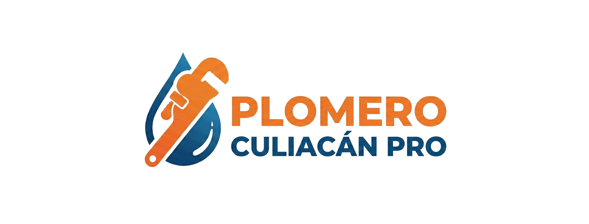

# Landing Creator

Crea nuevas landing pages clonando el estilo exacto de plomerolosmochispro.mx. Solo necesitas proporcionar contenido y fotos.

## Qué hace este comando

1. **Clona estilos exactos** - Copia todos los estilos, colores, fuentes, botones de index.html
2. **Estructura idéntica** - Header, hero, secciones, footer iguales
3. **SEO completo** - Meta tags, Open Graph, JSON-LD schemas automáticos
4. **Responsive** - Mobile-first como la homepage
5. **Solo pides contenido** - Tú solo das textos y rutas de imágenes

## Uso

```
/landing-creator
```

El comando te pedirá la información necesaria paso a paso.

## Instrucciones para Claude

### REGLAS CRÍTICAS - Leer primero

**⚠️ REGLA #0 - PROHIBIDO AGREGAR ELEMENTOS CUSTOM:**

Esta es la regla MÁS IMPORTANTE. NUNCA, bajo ninguna circunstancia:

- ❌ **PROHIBIDO:** Crear clases CSS que NO existan en index.html
- ❌ **PROHIBIDO:** Agregar `.highlight-box`, `.warning-box`, `.info-box`, `.note-box` o cualquier caja con color de fondo
- ❌ **PROHIBIDO:** Crear elementos amarillos, rojos, azules, verdes con bordes de colores
- ❌ **PROHIBIDO:** Inventar nuevos estilos más allá de los que están en index.html
- ❌ **PROHIBIDO:** Agregar divs decorativos con fondos de colores (#fef3c7, #fee2e2, etc.)

✅ **SOLO PERMITIDO:** Usar clases que YA EXISTEN en index.html:
  - `.hero`, `.hero-background`, `.hero-content`
  - `.section`, `.section-alt`
  - `.benefits-grid`, `.benefit-card`
  - `.grid`, `.card`
  - `.faq`, `.faq-item`
  - `.footer`
  - `.cta-bar`, `.cta-btn`
  - `.btn-primary`, `.btn-secondary`

Si necesitas resaltar contenido, usa SOLO:
  - Párrafos con `<strong>` o `<em>`
  - Listas `<ul>` o `<ol>` sin estilos custom
  - Encabezados `<h2>`, `<h3>` que ya tienen estilos en index.html

**Fuente de verdad:** https://plomerolosmochispro.mx/ (index.html)
**Clona ESTRICTAMENTE** - No agregues, no inventes, no mejores.

**⚠️ REGLA #0.1 - ESTRUCTURA HERO (CRÍTICO):**

El hero DEBE usar EXACTAMENTE esta estructura (index.html línea 1145):

```html
<header id="inicio" class="hero">
    <picture class="hero-background">
        <source type="image/webp"
                srcset="/assets/images/NOMBRE-800w.webp 800w, /assets/images/NOMBRE-1200w.webp 1200w"
                sizes="100vw">
        
    </picture>
    <div class="container">
        <div class="hero-content">...</div>
    </div>
</header>
```

❌ **ERRORES COMUNES A EVITAR:**
- ❌ NO usar `<div class="hero-background">` - DEBE ser `<picture class="hero-background">`
- ❌ NO omitir el elemento `<source type="image/webp">`
- ❌ NO omitir `decoding="async"` en el ``
- ❌ NO usar imágenes diferentes a las de index.html sin verificar
- ❌ NO omitir `content-visibility:auto` en el CSS de `.hero-background img`

**Imagen hero por defecto:**
- USAR: `hero-plomero-visita-800w.webp` y `hero-plomero-visita-1200w.webp` (igual que index.html)
- NO USAR: hero-plumbing-*.webp u otras imágenes a menos que el usuario las especifique

**⚠️ REGLA #0.2 - BOTONES FLOTANTES (CRÍTICO):**

Los botones flotantes (WhatsApp + Llamar) DEBEN usar EXACTAMENTE esta estructura (index.html línea 1356-1373):

```html
<a href="https://wa.me/526673922273?text=Hola%2C%20necesito%20un%20plomero%20urgente"
   id="cta-whatsapp"
   class="floating-btn floating-whatsapp"
   target="_blank"
   rel="noopener noreferrer"
   aria-label="Contactar por WhatsApp"><svg width="24" height="24" fill="currentColor" viewBox="0 0 24 24"><path d="M17.472 14.382c-.297-.149-1.758-.867-2.03-.967-.273-.099-.471-.148-.67.15-.197.297-.767.966-.94 1.164-.173.199-.347.223-.644.075-.297-.15-1.255-.463-2.39-1.475-.883-.788-1.48-1.761-1.653-2.059-.173-.297-.018-.458.13-.606.134-.133.298-.347.446-.52.149-.174.198-.298.298-.497.099-.198.05-.371-.025-.52-.075-.149-.669-1.612-.916-2.207-.242-.579-.487-.5-.669-.51-.173-.008-.371-.01-.57-.01-.198 0-.52.074-.792.372-.272.297-1.04 1.016-1.04 2.479 0 1.462 1.065 2.875 1.213 3.074.149.198 2.096 3.2 5.077 4.487.709.306 1.262.489 1.694.625.712.227 1.36.195 1.871.118.571-.085 1.758-.719 2.006-1.413.248-.694.248-1.289.173-1.413-.074-.124-.272-.198-.57-.347m-5.421 7.403h-.004a9.87 9.87 0 01-5.031-1.378l-.361-.214-3.741.982.998-3.648-.235-.374a9.86 9.86 0 01-1.51-5.26c.001-5.45 4.436-9.884 9.888-9.884 2.64 0 5.122 1.03 6.988 2.898a9.825 9.825 0 012.893 6.994c-.003 5.45-4.437 9.884-9.885 9.884m8.413-18.297A11.815 11.815 0 0012.05 0C5.495 0 .16 5.335.157 11.892c0 2.096.547 4.142 1.588 5.945L.057 24l6.305-1.654a11.882 11.882 0 005.683 1.448h.005c6.554 0 11.89-5.335 11.893-11.893a11.821 11.821 0 00-3.48-8.413z"/></svg></a><a href="tel:+526673922273"
   id="cta-llamar"
   class="floating-btn floating-call"
   aria-label="Llamar ahora"><svg width="24" height="24" fill="currentColor" viewBox="0 0 24 24"><path d="M20.01 15.38c-1.23 0-2.42-.2-3.53-.56a.977.977 0 00-1.01.24l-1.57 1.97c-2.83-1.35-5.48-3.9-6.89-6.83l1.95-1.66c.27-.28.35-.67.24-1.02-.37-1.11-.56-2.3-.56-3.53 0-.54-.45-.99-.99-.99H4.19C3.65 3 3 3.24 3 3.99 3 13.28 10.73 21 20.01 21c.71 0 .99-.63.99-1.18v-3.45c0-.54-.45-.99-.99-.99z"/></svg></a>
```

**CSS de botones flotantes (index.html línea 54-57):**
```css
.floating-btn{position:fixed;right:18px;width:54px;height:54px;border-radius:50%;display:grid;place-items:center;color:#fff;font-size:1.1rem;box-shadow:0 10px 28px rgba(0,0,0,0.16);transition:transform .12s ease,box-shadow .12s ease,filter .12s ease;z-index:60;text-decoration:none}
.floating-btn:hover{transform:translateY(-2px);box-shadow:0 14px 34px rgba(0,0,0,0.2);filter:brightness(1.05)}
.floating-call{background:#0f4fa8;bottom:18px}
.floating-whatsapp{background:#22c55e;bottom:78px}
```

❌ **ERRORES COMUNES A EVITAR:**
- ❌ NO usar emojis (💬 📞) - DEBE usar SVG icons completos
- ❌ NO usar `<div class="cta-bar">` - Botones van directos sin contenedor
- ❌ NO usar clases `.cta-btn`, `.cta-wa`, `.cta-tel` - DEBE usar `.floating-btn`, `.floating-whatsapp`, `.floating-call`
- ❌ NO usar colores incorrectos - WhatsApp: #22c55e (NO #25D366), Tel: #0f4fa8 (NO #0066cc)

**⚠️ REGLA #0.3 - CRITICAL CSS COMPLETO (CRÍTICO):**

Cada página DEBE incluir el bloque COMPLETO de Critical CSS de index.html (líneas 9-66). NO es suficiente copiar solo CSS individual de componentes.

**✅ DEBE incluir TODO el Critical CSS:**
```css
<style>
    /* Fonts (Inter + Montserrat) */
    @font-face{font-family:'Inter';font-style:normal;font-weight:400;...}
    @font-face{font-family:'Inter';font-style:normal;font-weight:500;...}
    @font-face{font-family:'Inter';font-style:normal;font-weight:600;...}
    @font-face{font-family:'Montserrat';font-style:normal;font-weight:700;...}
    @font-face{font-family:'Montserrat';font-style:normal;font-weight:800;...}

    /* CSS Variables */
    :root{--brand:#E36414;--brand-light:#F97316;...}

    /* Base styles */
    *{margin:0;padding:0;box-sizing:border-box}
    body{font-family:'Inter',...;padding-top:80px}
    .container{max-width:var(--container-max-width);margin:0 auto;...}
    h1,h2,h3{font-family:'Montserrat',sans-serif;...}

    /* Nav */
    .nav{position:fixed;top:0;left:0;right:0;z-index:50;...}
    .logo{...}
    .logo img{height:140px;...}

    /* Hero (CRÍTICO para centrado) */
    .hero{min-height:85vh;display:grid;place-items:center;text-align:center;...}
    .hero-background{position:absolute;inset:0;z-index:0;...}
    .hero-background img{width:100%;height:100%;object-fit:cover;content-visibility:auto}
    .hero-content{position:relative;z-index:2;max-width:900px;margin:0 auto;...}

    /* Buttons */
    .btn-primary{display:inline-block;background:linear-gradient(...);...}

    /* Floating buttons */
    .floating-btn{position:fixed;right:18px;...}
    .floating-call{background:#0f4fa8;bottom:18px}
    .floating-whatsapp{background:#22c55e;bottom:78px}

    /* Mobile responsive (CRÍTICO) */
    @media (max-width:768px){
        .logo img{height:90px;...}
        .hero{min-height:75vh;padding-top:85px!important;align-items:flex-start!important}
        .hero-background img{object-position:40% 35%}
        .hero-content{margin-top:0!important;padding:1.5rem 1.25rem!important;...}
        .hero h1{font-size:clamp(1.5rem,5vw,2rem)!important;...}
        ...
    }
</style>
```

❌ **ERROR COMÚN (causa problemas de alineación):**
```css
/* ❌ INCORRECTO - Solo copiar CSS de botones flotantes */
<style>
    .floating-btn{position:fixed;...}
    .floating-call{background:#0f4fa8;...}
    .floating-whatsapp{background:#22c55e;...}
</style>
```

**Consecuencias de Critical CSS incompleto:**
- ❌ Hero desalineado (título muy a la derecha o muy arriba)
- ❌ Fuentes web no cargan (se ve fuente del sistema)
- ❌ Variables CSS no definidas (colores rotos)
- ❌ Layout roto en mobile
- ❌ Nav mal posicionado
- ❌ Botones flotantes invisibles o mal estilizados

**Solución:**
1. Abrir `index.html`
2. Copiar TODO el bloque `<style>` de las líneas 9-66
3. Pegar en el `<head>` de la nueva página (después de los preloads)
4. NO modificar, NO eliminar líneas

**Caso de uso real:**
- Página: `servicios/instalacion-de-sanitarios/index.html`
- Problema: Hero título desalineado a la derecha
- Causa: Solo tenía 4 líneas de CSS (botones flotantes)
- Solución: Agregado bloque completo de 45 líneas
- Resultado: ✅ Hero centrado correctamente en mobile y desktop

**⚠️ REGLA #0.4 - VERIFICACIÓN MÓVIL Y ESCRITORIO (CRÍTICO):**

🚨 **TODAS las adecuaciones DEBEN funcionar perfectamente en AMBAS versiones:**

✅ **VERIFICACIÓN OBLIGATORIA después de CADA cambio:**
1. **Versión Desktop (1920px, 1440px, 1280px):**
   - Hero centrado perfectamente
   - Imágenes con dimensiones correctas
   - Textos legibles
   - Botones flotantes visibles (derecha inferior)
   - Espaciado correcto entre secciones

2. **Versión Móvil (375px, 390px, 428px):**
   - Hero responsive con `align-items:flex-start!important`
   - `.hero-content` con backdrop-filter y padding reducido
   - Textos legibles sin scroll horizontal
   - Botones flotantes NO obstruyen contenido
   - Menú hamburguesa funcional
   - Imágenes responsive (srcset correcto)

**❌ ERRORES COMUNES:**
- Solo probar en desktop y olvidar mobile
- Hero se ve bien en desktop pero roto en mobile
- Botones flotantes tapan contenido en móvil
- Imágenes muy grandes que rompen layout en 375px
- Textos que requieren zoom en mobile

**✅ PROCEDIMIENTO DE VERIFICACIÓN:**
1. Hacer cambio en código
2. Abrir en Safari (desktop): verificar layout 1440px
3. Abrir DevTools → Responsive Design Mode
4. Probar en iPhone SE (375px), iPhone 14 Pro (390px), iPhone 14 Pro Max (428px)
5. **SI HAY UN ERROR en cualquier versión:** corregir ANTES de continuar
6. Solo marcar como "terminado" cuando AMBAS versiones funcionen

**Comando para abrir y verificar:**
```bash
# Abrir página local
open "ruta/index.html"

# Verificar en Safari:
# 1. Desktop: Ver en tamaño completo
# 2. Mobile: Cmd+Opt+I → Responsive Design → iPhone 14 Pro (390px)
```

**Consecuencias de NO verificar ambas versiones:**
- ❌ Usuarios móvil (60%+ del tráfico) ven página rota
- ❌ Hero desalineado en mobile pero OK en desktop
- ❌ Botones flotantes invisibles en alguna versión
- ❌ Textos cortados o con scroll horizontal
- ❌ SEO penalizado por Google (mobile-first indexing)

**REGLA DE ORO:**
> **"Si no funciona PERFECTAMENTE en MÓVIL Y ESCRITORIO, NO está terminado."**

**⚠️ REGLA #0.5 - OPTIMIZACIÓN SEO OBLIGATORIA (CRÍTICO):**

🚨 **TODAS las landing pages DEBEN incluir estas 4 optimizaciones SEO:**

**1. Title Tag Optimizado:**
- ✅ Longitud: 50-60 caracteres (óptimo), máximo 70
- ✅ Formato: `[Keyword Principal] | Plomero Culiacán Pro`
- ✅ Keyword al inicio del title
- ❌ NO exceder 70 caracteres (Google corta el resto)

**2. Meta Description Optimizada:**
- ✅ Longitud: 120-155 caracteres (óptimo), máximo 160
- ✅ Incluir keyword principal + call-to-action
- ✅ Incluir beneficio clave + contacto (WhatsApp/Tel)
- ❌ NO exceder 160 caracteres (Google corta el resto)

**3. Breadcrumb HTML Navegable (OBLIGATORIO):**
- ✅ DEBE aparecer VISUALMENTE en la página (NO solo en schema)
- ✅ Ubicación: Entre `</nav>` y `<header class="hero">`
- ✅ Estructura inline con estilos simples
- ✅ Enlaces funcionales a Inicio y secciones padre

**Ejemplo de breadcrumb HTML:**
```html
<!-- Breadcrumb -->
<nav class="breadcrumb" aria-label="breadcrumb" style="background:#f8f9fa;padding:12px 0;font-size:14px;border-bottom:1px solid #e9ecef">
    <div class="container">
        <ol style="list-style:none;display:flex;gap:0.5rem;margin:0;padding:0;flex-wrap:wrap">
            <li><a href="https://plomerolosmochispro.mx/" style="color:#0066cc;text-decoration:none">Inicio</a></li>
            <li style="color:#6c757d">›</li>
            <li><a href="https://plomerolosmochispro.mx/#servicios" style="color:#0066cc;text-decoration:none">Servicios</a></li>
            <li style="color:#6c757d">›</li>
            <li style="color:#6c757d" aria-current="page">[Nombre Servicio]</li>
        </ol>
    </div>
</nav>
```

**4. Logo Footer con Dimensiones (OBLIGATORIO):**
- ✅ DEBE incluir atributos `width="512" height="195"`
- ✅ Reduce CLS (Cumulative Layout Shift)
- ✅ Mejora Core Web Vitals de Google

**Ejemplo:**
```html

```

**Consecuencias de NO incluir estas optimizaciones:**
- ❌ Penalización en rankings de Google
- ❌ CTR bajo en resultados de búsqueda (title/description cortados)
- ❌ Usuarios no encuentran navegación clara
- ❌ Core Web Vitals bajos (CLS por logo sin dimensiones)
- ❌ Menor visibilidad en búsquedas

**✅ VALIDACIÓN SEO antes de commit:**
```bash
# Verificar longitud de title y description:
# Title: contar caracteres (debe ser 50-60, máx 70)
# Description: contar caracteres (debe ser 120-155, máx 160)
# Breadcrumb: buscar <nav class="breadcrumb"> en HTML
# Logo footer: buscar width="512" height="195"
```

1. **Si rehaces una página existente que ya tiene hero:**
   - REMOVER el hero existente completamente
   - USAR SOLO la estructura del landing-creator
   - NO combinar estilos antiguos con nuevos
   - La página debe quedar 100% como index.html
   - **VERIFICAR resultado en MÓVIL Y ESCRITORIO**

2. **Estructura final debe contener ÚNICAMENTE:**
   - Hero con imagen de fondo (estilo index.html)
   - Secciones de beneficios (.benefits-grid)
   - Sección de servicios/artículos (.grid con .card)
   - Sección FAQs
   - Footer idéntico a index.html
   - Botones flotantes (WhatsApp + Tel)

3. **Estilos custom antiguos:**
   - ELIMINAR todos los `<style>` custom de la página antigua
   - USAR SOLO el critical CSS de index.html
   - USAR SOLO styles.min.css para estilos adicionales

3.1. **Logo (CRÍTICO):**
   - Archivo: `logo-512.webp` (16KB)
   - Dimensiones: width="512" height="195"
   - **Ruta según ubicación:**
     - Raíz (index.html): `/assets/images/logo-512.webp`
     - Subdirectorio (blog/, landings/): `../assets/images/logo-512.webp`
   - NUNCA usar: logo-plomero-los-mochis-pro.webp (NO EXISTE)
   - NUNCA usar: logo-2048.png (muy pesado)
   - **Regla:** Usar ruta relativa (`../`) en subdirectorios para compatibilidad local

4. **Cuando el usuario diga "rehaz esta página" o "corrige esta página":**
   - Preguntar: "¿Cuál es la URL o ruta del archivo a rehacer?"
   - Leer la página actual
   - Extraer SOLO el contenido (textos, FAQs)
   - ELIMINAR toda la estructura antigua
   - CREAR página nueva con estructura de index.html
   - REUTILIZAR el contenido extraído

### Proceso Interactivo

Cuando el usuario ejecute `/landing-creator`, sigue este proceso interactivo:

### Paso 1: Solicitar información básica

Preguntar al usuario (uno por uno, esperar respuesta):

```
🎨 Vamos a crear tu landing page con el estilo de plomerolosmochispro.mx

1️⃣ ¿Cuál es el slug de la página? (ejemplo: plomero-urgente)
   Se creará en: /<slug>/index.html
```

Esperar respuesta del usuario.

```
2️⃣ ¿Cuál es la keyword principal? (ejemplo: plomero urgente)
   Esto se usará en title, H1, meta description
```

Esperar respuesta.

```
3️⃣ ¿Cuál es el título H1? (ejemplo: Plomero Urgente en Culiacán 24/7)
   Máximo 60 caracteres recomendado
```

Esperar respuesta.

```
4️⃣ ¿Meta description? (ejemplo: Plomero urgente en Culiacán con llegada inmediata...)
   120-155 caracteres recomendado
```

Esperar respuesta.

### Paso 2: Solicitar contenido del hero

```
5️⃣ ¿Subtítulo del hero? (el texto debajo del H1)
   Ejemplo: Atención inmediata en toda la ciudad. Llegada en 15-30 min.
```

Esperar respuesta.

```
6️⃣ ¿Ruta de la imagen hero? (debe existir en assets/images/)
   Ejemplo: emergencia-hero-1200w.webp

   IMPORTANTE: La imagen debe estar en formato WebP y ser responsiva
   Debes tener versiones: 800w y 1200w
```

Esperar respuesta.

### Paso 3: Solicitar secciones de contenido

```
7️⃣ ¿Cuántas secciones de beneficios quieres? (recomendado: 4)
   Ejemplo: Respuesta rápida, Sin sobrecargos, Garantía 6 meses, Técnicos certificados
```

Esperar respuesta.

Para cada beneficio:
```
Beneficio #1:
  • Título: [esperar]
  • Descripción corta: [esperar]
  • Ícono SVG (opcional, se usará uno por defecto): [esperar o skip]
```

### Paso 4: Solicitar FAQs

```
8️⃣ ¿Cuántas FAQs quieres incluir? (recomendado: 8-10)
```

Para cada FAQ:
```
FAQ #1:
  • Pregunta: [esperar]
  • Respuesta: [esperar]
```

### Paso 5: Generar la página

Después de recopilar toda la información:

```
✅ Información completa recibida

📋 Resumen:
  • Slug: <slug>
  • Keyword: <keyword>
  • H1: <h1>
  • Hero image: <imagen>
  • Beneficios: <cantidad>
  • FAQs: <cantidad>

Generando landing page con estilo idéntico a la homepage...
```

### Paso 6: Leer estilos de index.html

Leer el archivo `index.html` y extraer:

1. **Todo el <style> del <head>** - Critical CSS inline
2. **Estructura del <header>** con nav y logo
3. **Estructura del hero** con background image
4. **Estructura de secciones** (.section, .section-alt)
5. **Estructura de benefits/features**
6. **Estructura del footer**
7. **CTA fijo** (WhatsApp + Llamar)
8. **Scripts de tracking**

### Paso 7: Crear el HTML completo

Generar archivo `<slug>/index.html` con:

#### 1. Head completo

```html
<!DOCTYPE html>
<html lang="es-MX">
<head>
<meta charset="UTF-8">
<meta name="viewport" content="width=device-width, initial-scale=1.0">
<title><keyword optimizado 50-60 chars> | Plomero Culiacán Pro</title>
<meta name="description" content="<meta description 120-155 caracteres>">
<meta name="keywords" content="<keyword>, plomero culiacan, <variaciones>">
<meta name="robots" content="index, follow, max-image-preview:large">

<!-- Favicons (copiar exactos de index.html) -->
<link rel="icon" href="/assets/icons/favicon.ico" sizes="any">
<link rel="icon" type="image/png" sizes="16x16" href="/assets/icons/favicon-16x16.png">
<!-- ... todos los favicons ... -->

<link rel="canonical" href="https://plomerolosmochispro.mx/<slug>/">

<!-- Open Graph -->
<meta property="og:title" content="<h1>">
<meta property="og:description" content="<meta description>">
<meta property="og:image" content="https://plomerolosmochispro.mx/assets/images/<hero-image>">
<meta property="og:url" content="https://plomerolosmochispro.mx/<slug>/">
<meta property="og:type" content="website">
<meta property="og:locale" content="es_MX">

<!-- Twitter Cards -->
<meta name="twitter:card" content="summary_large_image">
<meta name="twitter:title" content="<h1>">
<meta name="twitter:description" content="<meta description>">
<meta name="twitter:image" content="https://plomerolosmochispro.mx/assets/images/<hero-image>">

<!-- Preloads -->
<link rel="preload" as="image" href="/assets/images/<hero-image>" fetchpriority="high">
<link rel="preload" href="/assets/fonts/inter-400.woff2" as="font" type="font/woff2" crossorigin fetchpriority="high">
<link rel="preload" href="/assets/fonts/inter-500.woff2" as="font" type="font/woff2" crossorigin fetchpriority="high">
<link rel="preload" href="/assets/fonts/montserrat-800.woff2" as="font" type="font/woff2" crossorigin fetchpriority="high">

<!-- COPIAR TODO EL <style> DE index.html EXACTO -->
<style>
  /* Copiar los estilos completos de index.html */
</style>

<!-- JSON-LD Schema -->
<script type="application/ld+json">
{
  "@context": "https://schema.org",
  "@graph": [
    {
      "@type": "WebSite",
      "name": "Plomero Culiacán Pro",
      "url": "https://plomerolosmochispro.mx/",
      "logo": "https://plomerolosmochispro.mx/assets/images/logo-512.png"
    },
    {
      "@type": "BreadcrumbList",
      "itemListElement": [
        {
          "@type": "ListItem",
          "position": 1,
          "name": "Inicio",
          "item": "https://plomerolosmochispro.mx/"
        },
        {
          "@type": "ListItem",
          "position": 2,
          "name": "<h1>",
          "item": "https://plomerolosmochispro.mx/<slug>/"
        }
      ]
    },
    {
      "@type": "Service",
      "serviceType": "<keyword>",
      "name": "<h1>",
      "description": "<meta description>",
      "provider": {
        "@type": "HomeAndConstructionBusiness",
        "name": "Plomero Culiacán Pro",
        "telephone": "+52 667 392 2273",
        "address": {
          "@type": "PostalAddress",
          "addressLocality": "Culiacán",
          "addressRegion": "Sinaloa",
          "addressCountry": "MX"
        },
        "geo": {
          "@type": "GeoCoordinates",
          "latitude": "25.7928",
          "longitude": "-108.9902"
        },
        "aggregateRating": {
          "@type": "AggregateRating",
          "ratingValue": "4.8",
          "reviewCount": "150",
          "bestRating": "5"
        }
      },
      "areaServed": {
        "@type": "City",
        "name": "Culiacán"
      }
    },
    {
      "@type": "FAQPage",
      "mainEntity": [
        <!-- Generar cada FAQ proporcionada -->
        {
          "@type": "Question",
          "name": "<pregunta>",
          "acceptedAnswer": {
            "@type": "Answer",
            "text": "<respuesta>"
          }
        }
      ]
    }
  ]
}
</script>
</head>
```

#### 2. Body con estructura idéntica

```html
<body>
<!-- COPIAR <nav> EXACTO de index.html -->
<nav class="nav">
  <div class="container">
    <div class="nav-wrapper">
      <a href="/" class="logo">
        
      </a>
      <!-- Menu items -->
    </div>
  </div>
</nav>

<!-- Breadcrumb (OBLIGATORIO para SEO) -->
<nav class="breadcrumb" aria-label="breadcrumb" style="background:#f8f9fa;padding:12px 0;font-size:14px;border-bottom:1px solid #e9ecef">
    <div class="container">
        <ol style="list-style:none;display:flex;gap:0.5rem;margin:0;padding:0;flex-wrap:wrap">
            <li><a href="https://plomerolosmochispro.mx/" style="color:#0066cc;text-decoration:none">Inicio</a></li>
            <li style="color:#6c757d">›</li>
            <li><a href="https://plomerolosmochispro.mx/#servicios" style="color:#0066cc;text-decoration:none">Servicios</a></li>
            <li style="color:#6c757d">›</li>
            <li style="color:#6c757d" aria-current="page"><nombre-servicio></li>
        </ol>
    </div>
</nav>

<!-- Hero -->
<header id="inicio" class="hero">
  <picture class="hero-background">
    <source type="image/webp"
            srcset="/assets/images/<hero-800w>.webp 800w, /assets/images/<hero-1200w>.webp 1200w"
            sizes="100vw">
    .webp"
         srcset="/assets/images/<hero-800w>.webp 800w, /assets/images/<hero-1200w>.webp 1200w"
         sizes="100vw"
         alt="<alt-text>"
         width="1200"
         height="800"
         fetchpriority="high"
         decoding="async">
  </picture>
  <div class="container">
    <div class="hero-content">
      <h1><h1-text></h1>
      <p class="hero-subtitle"><subtitulo></p>

      <!-- Rating badge (copiar de index.html) -->
      <div class="hero-rating">
        
        <span class="rating-stars">★★★★★</span>
        <span class="rating-score">4.8</span>
        <span class="rating-divider">|</span>
        <span class="rating-count">150 reseñas</span>
      </div>

      <!-- Features (copiar estructura de index.html) -->
      <div class="hero-features">
        <div class="feature-item">
          <svg class="feature-icon"><!-- clock icon --></svg>
          <span>Llegada 30-60 min</span>
        </div>
        <div class="feature-item">
          <svg class="feature-icon"><!-- check icon --></svg>
          <span>Garantía 6 meses</span>
        </div>
        <div class="feature-item">
          <svg class="feature-icon"><!-- 24/7 icon --></svg>
          <span>Servicio 24/7</span>
        </div>
      </div>

      <a href="#contacto" class="btn-primary">Solicitar Servicio Ahora</a>
    </div>
  </div>
</header>

<!-- Sección Beneficios -->
<section class="section">
  <div class="container">
    <h2>¿Por qué elegirnos?</h2>
    <div class="benefits-grid">
      <!-- Para cada beneficio proporcionado -->
      <div class="benefit-card">
        <svg class="benefit-icon"><!-- SVG proporcionado o por defecto --></svg>
        <h3><titulo-beneficio></h3>
        <p><descripcion-beneficio></p>
      </div>
    </div>
  </div>
</section>

<!-- Sección Servicios (copiar estructura de index.html) -->
<section class="section section-alt">
  <div class="container">
    <h2>Servicios de <keyword></h2>
    <!-- Grid de servicios -->
  </div>
</section>

<!-- Sección FAQs -->
<section class="section">
  <div class="container">
    <h2>Preguntas Frecuentes</h2>
    <div class="faq-list">
      <!-- Para cada FAQ proporcionada -->
      <details class="faq-item">
        <summary><pregunta></summary>
        <p><respuesta></p>
      </details>
    </div>
  </div>
</section>

<!-- Sección Contacto (copiar de index.html) -->
<section id="contacto" class="section">
  <div class="container">
    <h2>Contacta con Nosotros</h2>
    <div class="final-cta">
      <p class="cta-text">WhatsApp: 52 667 392 2273 · Llamadas: 667 392 2273</p>
      <div class="cta-buttons">
        <a href="https://wa.me/526673922273" target="_blank" class="btn-primary btn-whatsapp">WhatsApp</a>
        <a href="tel:6673922273" class="btn-secondary">Llamar</a>
      </div>
    </div>
  </div>
</section>

<!-- COPIAR Footer EXACTO de index.html -->
<!-- IMPORTANTE: Logo footer DEBE incluir width="512" height="195" -->
<footer class="footer">
  <div class="container">
    <div class="footer-content">
      <div class="footer-section">
        
        <!-- ... resto del footer ... -->
      </div>
    </div>
  </div>
</footer>

<!-- COPIAR Botones Flotantes EXACTO de index.html -->
<a href="https://wa.me/526673922273?text=Hola%2C%20necesito%20un%20plomero%20urgente"
   id="cta-whatsapp"
   class="floating-btn floating-whatsapp"
   target="_blank"
   rel="noopener noreferrer"
   aria-label="Contactar por WhatsApp"><svg width="24" height="24" fill="currentColor" viewBox="0 0 24 24"><path d="M17.472 14.382c-.297-.149-1.758-.867-2.03-.967-.273-.099-.471-.148-.67.15-.197.297-.767.966-.94 1.164-.173.199-.347.223-.644.075-.297-.15-1.255-.463-2.39-1.475-.883-.788-1.48-1.761-1.653-2.059-.173-.297-.018-.458.13-.606.134-.133.298-.347.446-.52.149-.174.198-.298.298-.497.099-.198.05-.371-.025-.52-.075-.149-.669-1.612-.916-2.207-.242-.579-.487-.5-.669-.51-.173-.008-.371-.01-.57-.01-.198 0-.52.074-.792.372-.272.297-1.04 1.016-1.04 2.479 0 1.462 1.065 2.875 1.213 3.074.149.198 2.096 3.2 5.077 4.487.709.306 1.262.489 1.694.625.712.227 1.36.195 1.871.118.571-.085 1.758-.719 2.006-1.413.248-.694.248-1.289.173-1.413-.074-.124-.272-.198-.57-.347m-5.421 7.403h-.004a9.87 9.87 0 01-5.031-1.378l-.361-.214-3.741.982.998-3.648-.235-.374a9.86 9.86 0 01-1.51-5.26c.001-5.45 4.436-9.884 9.888-9.884 2.64 0 5.122 1.03 6.988 2.898a9.825 9.825 0 012.893 6.994c-.003 5.45-4.437 9.884-9.885 9.884m8.413-18.297A11.815 11.815 0 0012.05 0C5.495 0 .16 5.335.157 11.892c0 2.096.547 4.142 1.588 5.945L.057 24l6.305-1.654a11.882 11.882 0 005.683 1.448h.005c6.554 0 11.89-5.335 11.893-11.893a11.821 11.821 0 00-3.48-8.413z"/></svg></a><a href="tel:+526673922273"
   id="cta-llamar"
   class="floating-btn floating-call"
   aria-label="Llamar ahora"><svg width="24" height="24" fill="currentColor" viewBox="0 0 24 24"><path d="M20.01 15.38c-1.23 0-2.42-.2-3.53-.56a.977.977 0 00-1.01.24l-1.57 1.97c-2.83-1.35-5.48-3.9-6.89-6.83l1.95-1.66c.27-.28.35-.67.24-1.02-.37-1.11-.56-2.3-.56-3.53 0-.54-.45-.99-.99-.99H4.19C3.65 3 3 3.24 3 3.99 3 13.28 10.73 21 20.01 21c.71 0 .99-.63.99-1.18v-3.45c0-.54-.45-.99-.99-.99z"/></svg></a>

<script>
  <!-- Copiar script de tracking exacto de index.html -->
</script>

</body>
</html>
```

### Paso 8: Crear directorio y archivo

1. Crear directorio: `<slug>/`
2. Crear archivo: `<slug>/index.html`
3. Escribir el HTML completo generado

### Paso 9: Confirmar y next steps

```
✅ Landing page creada exitosamente

📁 Ubicación: /<slug>/index.html
🌐 URL cuando publiques: https://plomerolosmochispro.mx/<slug>/

📋 Archivos que necesitas agregar:
  ❌ /assets/images/<hero-800w>.webp  (NO EXISTE)
  ❌ /assets/images/<hero-1200w>.webp (NO EXISTE)

⚠️ IMPORTANTE: Antes de publicar
1. Agrega las imágenes hero en assets/images/
2. Verifica que las imágenes estén en formato WebP
3. Actualiza sitemap.xml (puedo hacerlo por ti)
4. Prueba la página localmente

¿Quieres que:
  a) Actualice sitemap.xml con esta nueva página
  b) Te ayude a optimizar las imágenes a WebP
  c) Publique directamente con /deploy-quick
```

## Reglas importantes

1. **NUNCA modificar estilos** - Copiar exactamente de index.html
2. **NUNCA inventar contenido** - Usar solo lo que el usuario proporciona
3. **NUNCA crear clases CSS custom** - SOLO usar clases de index.html (ver REGLA #0 arriba)
4. **NUNCA agregar cajas de colores** - Prohibido .highlight-box, .warning-box, .info-box, etc.
5. **SIEMPRE crear backup** - Antes de sobrescribir archivos
6. **SIEMPRE validar imágenes** - Verificar que existan las rutas proporcionadas
7. **SIEMPRE generar schemas completos** - WebSite, Service, FAQPage, BreadcrumbList
6. **AL REHACER páginas existentes:**
   - ELIMINAR hero custom antiguo (linear-gradient, estilos inline)
   - ELIMINAR todos los estilos custom (`<style>` inline)
   - USAR SOLO estructura de index.html
   - CREAR backup automático antes de sobrescribir
   - REUTILIZAR contenido (textos, FAQs) pero NO estructura
7. **Estructura final SOLO debe tener:**
   - Hero con `<picture class="hero-background">` (NO `<div>`)
   - Benefits grid (.benefits-grid)
   - Grid + Cards (.grid + .card)
   - FAQs (.faq + .faq-item)
   - Footer idéntico a index.html
   - Botones flotantes (.cta-bar)
8. **VERIFICACIÓN FINAL antes de entregar:**

   **🔍 CHECKLIST TÉCNICO:**
   - ✅ **Critical CSS completo** incluido de index.html (líneas 9-66) - fonts, variables, base, nav, hero, buttons, mobile responsive
   - ✅ Hero usa `<picture class="hero-background">` (NO `<div>`)
   - ✅ Tiene `<source type="image/webp">` con srcset
   - ✅ `` tiene `decoding="async"` y `fetchpriority="high"`
   - ✅ CSS incluye `content-visibility:auto` en `.hero-background img`
   - ✅ CSS incluye `display:grid;place-items:center` en `.hero` (centrado correcto)
   - ✅ CSS incluye `margin:0 auto` en `.hero-content` (centrado horizontal)
   - ✅ CSS incluye media queries completas para mobile (responsive)
   - ✅ Imagen hero es `hero-plomero-visita-*` (a menos que usuario especifique otra)
   - ✅ NO hay clases custom (.highlight-box, .warning-box, etc.)
   - ✅ Botones flotantes usan SVG icons (NO emojis 💬 📞)
   - ✅ Botones usan clases `.floating-btn`, `.floating-whatsapp`, `.floating-call`
   - ✅ Colores correctos: WhatsApp #22c55e, Tel #0f4fa8

   **🎯 CHECKLIST SEO OBLIGATORIO (REGLA #0.5):**
   - ✅ Title optimizado: 50-60 caracteres (máx 70)
   - ✅ Meta description optimizada: 120-155 caracteres (máx 160)
   - ✅ Breadcrumb HTML visible presente (después de </nav>, antes de hero)
   - ✅ Logo footer con width="512" height="195"
   - ✅ Keyword principal al inicio del title
   - ✅ Breadcrumb con enlaces funcionales a Inicio y Servicios

   **📱 VERIFICACIÓN VISUAL OBLIGATORIA (CRÍTICO):**

   🚨 **ANTES de hacer commit, DEBES probar en AMBAS versiones:**

   **Desktop (1440px):**
   - ✅ Hero centrado con imagen de fondo visible
   - ✅ Título h1 centrado horizontalmente
   - ✅ Botones flotantes visibles en esquina derecha inferior
   - ✅ Todas las secciones alineadas correctamente
   - ✅ Footer completo visible
   - ✅ Imágenes cargando correctamente

   **Mobile (390px - iPhone 14 Pro):**
   - ✅ Hero responsive: `align-items:flex-start!important`
   - ✅ `.hero-content` con fondo glassmorphic (backdrop-filter)
   - ✅ Título h1 legible sin zoom (1.5rem-2rem)
   - ✅ Botones flotantes NO tapan contenido
   - ✅ Menú hamburguesa funcional
   - ✅ Sin scroll horizontal
   - ✅ Imágenes responsive (srcset 800w cargando en mobile)
   - ✅ Todos los textos legibles sin hacer zoom

   **Cómo verificar:**
   ```bash
   # 1. Abrir página
   open "ruta/index.html"

   # 2. Verificar desktop (Safari en ventana completa)
   # 3. Verificar mobile:
   #    - Cmd+Opt+I (DevTools)
   #    - Responsive Design Mode
   #    - Seleccionar "iPhone 14 Pro" (390x844)
   #    - Scrollear toda la página verificando cada sección
   ```

   **❌ NO HACER COMMIT si:**
   - Página se ve rota en mobile
   - Hero desalineado en cualquier versión
   - Botones flotantes invisibles
   - Scroll horizontal en mobile
   - Imágenes muy grandes en mobile

   **✅ SOLO HACER COMMIT cuando:**
   - Desktop ✅ Perfecto
   - Mobile ✅ Perfecto
   - Ambas versiones probadas ✅

## Validaciones

Antes de generar:
- ✅ Slug no contiene espacios ni caracteres especiales
- ✅ Keyword tiene entre 2-5 palabras
- ✅ H1 tiene menos de 70 caracteres
- ✅ Meta description tiene 120-155 caracteres
- ✅ Al menos 3 beneficios proporcionados
- ✅ Al menos 5 FAQs proporcionadas

Si algo falta o es inválido, preguntar de nuevo.

## Ejemplo de flujo completo

```
Usuario: /landing-creator

Claude:
🎨 Vamos a crear tu landing page con el estilo de plomerolosmochispro.mx

1️⃣ ¿Cuál es el slug de la página?

Usuario: plomero-urgente

Claude:
✅ Slug: plomero-urgente
   Se creará en: /plomero-urgente/index.html

2️⃣ ¿Cuál es la keyword principal?

Usuario: plomero urgente

Claude:
✅ Keyword: plomero urgente

3️⃣ ¿Cuál es el título H1?

Usuario: Plomero Urgente en Culiacán - Atención Inmediata 24/7

Claude:
✅ H1: Plomero Urgente en Culiacán - Atención Inmediata 24/7
   (65 caracteres - perfecto)

4️⃣ ¿Meta description?

Usuario: Plomero urgente en Culiacán con llegada en 15-30 minutos. Atención 24/7 para emergencias. Técnicos certificados. WhatsApp 667-392-2273

Claude:
✅ Meta description (142 caracteres - perfecto)

5️⃣ ¿Subtítulo del hero?

Usuario: Emergencias de plomería atendidas inmediatamente. Llegada rápida en toda la ciudad. Sin sobrecargos nocturnos.

Claude:
✅ Subtítulo guardado

6️⃣ ¿Ruta de la imagen hero?

Usuario: emergencia-nocturna-1200w.webp

Claude:
✅ Imagen hero: emergencia-nocturna-1200w.webp
   Nota: Deberás tener también emergencia-nocturna-800w.webp

7️⃣ ¿Cuántas secciones de beneficios quieres?

Usuario: 4

Claude:
Beneficio #1:
  • Título:

Usuario: Llegada Inmediata

Claude:
  • Descripción corta:

Usuario: Llegamos en 15-30 minutos a cualquier zona de Culiacán

Claude:
  • Ícono SVG (enter para usar por defecto):

[Usuario presiona enter]

Claude:
✅ Beneficio #1 guardado (ícono por defecto: reloj)

Beneficio #2:
  • Título:

[... continúa para los 4 beneficios ...]

Claude:
✅ 4 Beneficios guardados

8️⃣ ¿Cuántas FAQs quieres incluir?

Usuario: 6

Claude:
FAQ #1:
  • Pregunta:

Usuario: ¿Cuánto tardan en llegar en una emergencia urgente?

Claude:
  • Respuesta:

Usuario: Llegamos en 15-30 minutos a cualquier zona de Culiacán. Confirmamos tiempo exacto por WhatsApp antes de salir.

[... continúa para las 6 FAQs ...]

Claude:
✅ Información completa recibida

📋 Resumen:
  • Slug: plomero-urgente
  • Keyword: plomero urgente
  • H1: Plomero Urgente en Culiacán - Atención Inmediata 24/7
  • Hero image: emergencia-nocturna-1200w.webp
  • Beneficios: 4
  • FAQs: 6

Generando landing page con estilo idéntico a la homepage...

[Leer index.html...]
[Generar HTML completo...]
[Crear directorio plomero-urgente/...]
[Escribir index.html...]

✅ Landing page creada exitosamente

📁 Ubicación: /plomero-urgente/index.html
🌐 URL cuando publiques: https://plomerolosmochispro.mx/plomero-urgente/

📋 Archivos que necesitas agregar:
  ❌ /assets/images/emergencia-nocturna-800w.webp  (NO EXISTE)
  ❌ /assets/images/emergencia-nocturna-1200w.webp (NO EXISTE)

⚠️ IMPORTANTE: Antes de publicar
1. Agrega las imágenes hero en assets/images/
2. Verifica que las imágenes estén en formato WebP
3. Actualiza sitemap.xml

¿Quieres que actualice sitemap.xml? (s/n)
```

## Estructura de directorios esperada

```
plomero-culiacan-pro/
├── assets/
│   ├── images/
│   │   ├── <hero-800w>.webp     ← Usuario debe agregar
│   │   ├── <hero-1200w>.webp    ← Usuario debe agregar
│   │   └── logo-512.webp
│   └── fonts/
│       ├── inter-400.woff2
│       └── ...
├── index.html
├── sitemap.xml
└── <slug>/                        ← Se crea automáticamente
    └── index.html                 ← Se genera con este comando
```

## Flujo para Rehacer Páginas Existentes

### Cuando el usuario dice "rehaz esta página" o "corrige [URL/ruta]"

1. **Detectar intención de rehacer:**
   ```
   Usuario: "rehaz /blog/index.html"
   Usuario: "corrige la página de blog"
   Usuario: "esta página está distinta, vamos a usar landing-creator"
   ```

2. **Confirmar ruta y leer contenido actual:**
   ```
   ✅ Entiendo que quieres rehacer: /blog/index.html

   📖 Leyendo contenido actual...
   ```

3. **Extraer contenido útil (NO estructura):**
   - H1 y subtítulos
   - Descripción meta
   - Textos de beneficios/secciones
   - FAQs existentes
   - Imágenes referenciadas

4. **Crear backup automático:**
   ```bash
   cp /blog/index.html /blog/index.html.backup-$(date +%Y%m%d)
   ```

5. **Generar página nueva con estructura de index.html:**
   - ELIMINAR hero custom antiguo
   - ELIMINAR estilos inline custom
   - USAR hero con imagen de fondo (como index.html)
   - USAR benefits-grid (como index.html)
   - USAR grid + card (como index.html)
   - REUTILIZAR contenido extraído

6. **Confirmar cambios:**
   ```
   ✅ Página rehecha con estilo idéntico a homepage

   📋 Cambios realizados:
     ❌ ELIMINADO: Hero custom con estilos inline
     ❌ ELIMINADO: 275 líneas de CSS custom
     ✅ AGREGADO: Hero con imagen de fondo
     ✅ AGREGADO: Benefits grid (4 categorías)
     ✅ AGREGADO: Critical CSS inline
     ✅ MANTENIDO: Todo el contenido (textos, FAQs)

   📁 Backup guardado en: /blog/index.html.backup-20251127

   ¿Quieres publicar con /deploy-quick? (s/n)
   ```

### Ejemplo de flujo completo - Rehacer página

```
Usuario: "esta página está distinta, vamos a usar el @.claude/commands/landing-creator.md para hacerla como nos gusta"

Claude:
✅ Entiendo que quieres rehacer esta página con el estilo de la homepage.

¿Cuál es la ruta del archivo? (ejemplo: /blog/index.html)

Usuario: /blog/index.html

Claude:
📖 Leyendo /blog/index.html...

He extraído el contenido:
  • H1: "Blog de Plomería Culiacán"
  • Subtítulo: "Guías expertas, precios reales..."
  • 4 categorías detectadas
  • 6 artículos destacados
  • 6 FAQs

Voy a rehacer la página con:
  ❌ ELIMINAR: Hero custom con linear-gradient
  ❌ ELIMINAR: Estilos .blog-hero, .blog-card, etc.
  ✅ USAR: Hero con imagen de fondo (como homepage)
  ✅ USAR: Benefits grid para categorías
  ✅ USAR: Grid + cards para artículos

¿Confirmas que quieres proceder? (s/n)

Usuario: si

Claude:
📦 Creando backup...
✅ Backup: /blog/index.html.backup-20251127

🔨 Rehaciendo página...
  [1/5] Copiando critical CSS de index.html
  [2/5] Creando hero con imagen de fondo
  [3/5] Convirtiendo categorías → benefits-grid
  [4/5] Convirtiendo artículos → grid + cards
  [5/5] Agregando footer + CTAs flotantes

✅ Página rehecha exitosamente

📊 Resumen de cambios:
  • Antes: 569 líneas (estilos custom + estructura custom)
  • Después: 527 líneas (critical CSS + estructura homepage)
  • Reducción: -42 líneas (-7.4%)
  • Estilos: 100% unificados con homepage

📁 Archivos:
  • Original backup: /blog/index.html.backup-20251127
  • Nueva versión: /blog/index.html

¿Quieres publicar con /deploy-quick? (s/n)
```

## Notas finales

- El estilo es 100% idéntico a index.html (copiar, no modificar)
- Solo el contenido cambia (textos, imágenes del usuario)
- Responsive automático (mismo CSS que homepage)
- SEO completo automático (schemas, meta tags, OG, canonical)
- El usuario solo necesita: textos + fotos
- **Al rehacer páginas: ELIMINAR hero custom, USAR hero con imagen de fondo**
- **Siempre crear backup antes de sobrescribir**
- 🚨 **CRÍTICO: SIEMPRE verificar resultado en MÓVIL Y ESCRITORIO antes de commit**
- 🚨 **NO hacer commit hasta que AMBAS versiones se vean perfectas**
- 🚨 **60%+ usuarios son móvil - mobile DEBE funcionar perfecto**
